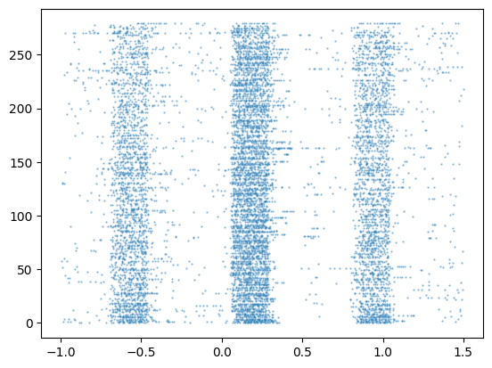
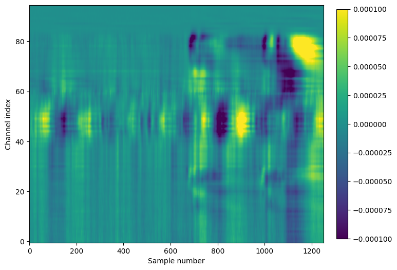

# Spike alignment algorithms

**Goal:** Align spike times to a set of events, returning either the exact relative times or counts in a set of bins.

**Rationale:** This is an extremely common operation, so we choose a standard approach and output format. Because we'll be running lots of code in the cloud, it's important to choose a method that is as efficient as possible.

## Candidate algorithms

1. **numpy method** -- Use a `for` loop and `numpy.searchsorted` to select spikes around each event time, and concatenate the results. Optionally count the spikes per bin using `numpy.histogram`

2. **pandas method** -- Use a Pandas `cut` operation to slice the spike times in a single step, followed by another `cut` to perform the binning.

3. **Pynapple method** -- Use the Numba-accelerated `compute_perievent` from the [Pynapple](https://peyrachelab.github.io/pynapple/) package.

4. **IBL method** -- Use `get_event_aligned_raster` from IBL's [brainbox](https://int-brain-lab.github.io/iblenv/_autosummary/brainbox.html) package.

## Test case

Aligning spikes from the [Visual Behavior Neuropixels](https://allensdk.readthedocs.io/en/latest/visual_behavior_neuropixels.html) dataset to the onset of a change stimulus.

**Parameters:**

- 100 units from V1 with firing rate > 0.1 Hz
- Window from -1 to +1.5 seconds around trial onset (280 trials)
- (optional) bin size of 0.01 s

Example raster for one unit:

**Evaluation criteria:**

- Speed of computation (based on `cProfile` output)
- Flexibility of API
- Return type -- how easy is it to filter and/or plot the results?

## Results

### Comparison table

| Method   | Function name              | Return spike times | Return binned | Execution time |
| -------- | -------------------------- | ------------------ | ------------- | -------------- |
| numpy    | `align_spikes`             | ✅                 | ✅            | 0.028 s        |
| pandas   | `align_spikes`             | ✅                 | ✅            | 0.245 s        |
| Pynapple | `compute_perievent`        | ✅                 | ❌            | 1.601 s        |
| IBL      | `get_event_aligned_raster` | ❌                 | ✅            | 0.031 s        |

### Summary

#### Speed of computation

The speed of execution varied by over 3 orders of magnitude. This was tested by running `cProfile` on the calculation of binned spike times (if available). The **numpy** method and **IBL** method were the fastest, performing the alignment and binning operations for one unit in around 30 ms. The **pandas** method took about 10x longer, while the **Pynapple** method took the longest, at 1.6 seconds, despite using Numba `jit` to speed up computation.

**Winners:** numpy + IBL

#### Flexibility of API

All of the methods had similar input arguments, which include the spike times to align, the event times to align to, and the alignment window. However, the **Pynapple** method doesn't support binning, and the **IBL** method enforces binning (setting `bin = False` always resulted in an error).

**Winners:** numpy + pandas

#### Return type

The **numpy** and **IBL** methods returned `numpy` arrays, which are easy to work with, but lack any semantic information. The **Pynapple** method returned a dictionary of `Ts` objects, which was quite slow to plot due to the need to loop through the dictionary. The **pandas** method returned a `DataFrame`, which could be easily plotted (or extended with additional columns of metadata).

**Winner:** pandas

### Overall winner

The best option appears to be the **numpy** method, due to its speed, flexibility, and the ease of which the results can be transformed into a Pandas `DataFrame` or xarray `DataArray` for further manipulation.

# LFP alignment algorithms

**Goal:** Align LFP samples to a set of events, returning a matrix with dimensions of times, channels, and trials.

**Rationale:** Similar to spike time alignment, this is an extremely common operation. Because we'll be running lots of code in the cloud, it's important to choose a method that is as efficient as possible.

## Candidate algorithms

1. **numpy method** -- Use a `for` loop to select samples around each event time, and concatenate the results.

2. **pandas method** -- Use Pandas and xarray operations to select the relevant data.

3. **Pynapple method** -- Use `compute_perievent` from the [Pynapple](https://peyrachelab.github.io/pynapple/) package.

## Test case

Aligning LFP from the [Visual Coding Neuropixels](https://allensdk.readthedocs.io/en/latest/visual_coding_neuropixels.html) dataset to the onset of a flash stimulus.

**Parameters:**

- Use data returned by AllenSDK (every 4th channel, 1250 Hz sampling rate)
- Window from -0.5 to +0.5 seconds around trial onset (150 trials)

Mean LFP trace:

**Evaluation criteria:**

- Speed of computation (based on `cProfile` output)
- Flexibility of API
- Return type -- how easy is it to filter and/or plot the results?

## Results

### Comparison table

| Method   | Function name       | LFP alignment | Execution time |
| -------- | ------------------- | ------------- | -------------- |
| numpy    | `align_lfp`         | ✅            | 0.102 s        |
| pandas   | `align_lfp`         | ✅            | 0.076 s        |
| Pynapple | `compute_perievent` | ✅            | 10+ minutes    |
| IBL      | not implemented     | ❌            | N/A            |

### Summary

#### Speed of computation

The **pandas** method was the fastest, returning in about 75 ms. The **numpy** took 35% longer, but was still quick at around 100 ms. The **Pynapple** method took more than 10 minutes to complete. There are two reasons for this: (1) the data had to be transformed into a `TsGroup` object, with a separate `Tsd` object for each channel, prior to alignment, and (2) each `Tsd` object was aligned separately, even though they all share the same timestamps. Perhaps there is a way around this, but it's not clear from the documentation.

**Winner:** pandas

#### Flexibility of API

All of the methods had similar input arguments, which include the LFP samples, the event times to align to, and the alignment window. However, the **Pynapple** method requires the input be data be formatted as a `TsGroup` object, which is slow to generate from the original numpy or xarray data.

**Winners:** numpy + pandas

#### Return type

The **numpy** method returns a `numpy` array, which is easy to work with, but lacks any semantic information. The **pandas** method returned an xarray `DataSet`, which could be easily plotted or filtered further by time or channel. The **Pynapple** method returned a dictionary of `TsGroup` objects, which we didn't even attempt to plot because it was so cumbersome to compute the average.

**Winner:** pandas

### Overall winner

The best option appears to be the **pandas** method, due to its speed, flexibility, and the ease of which the results can be plotted and further manipulated.
